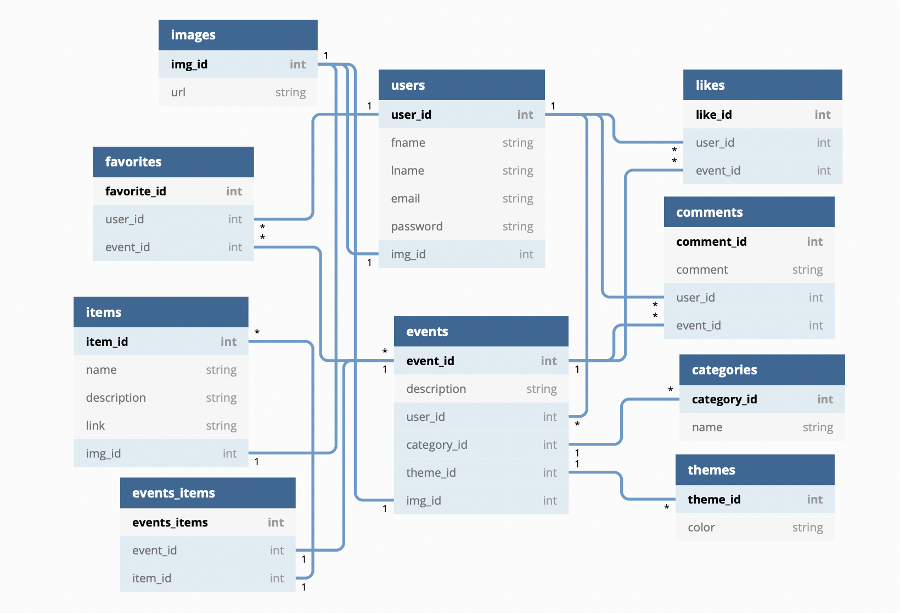
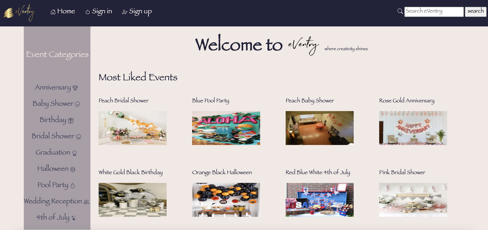
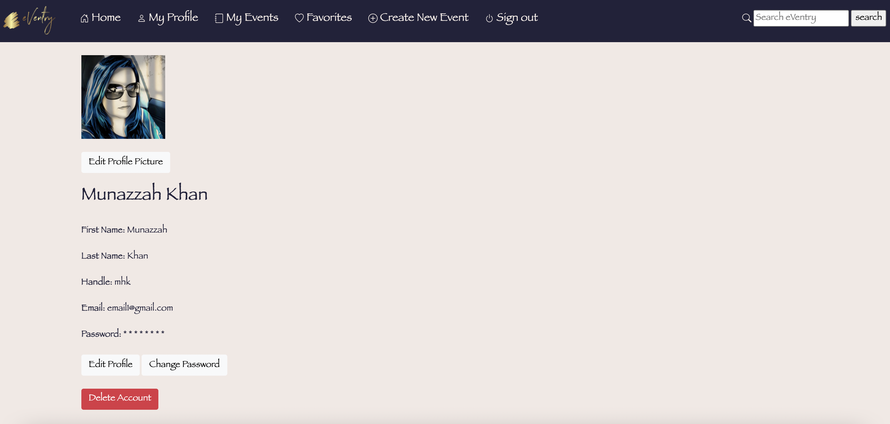
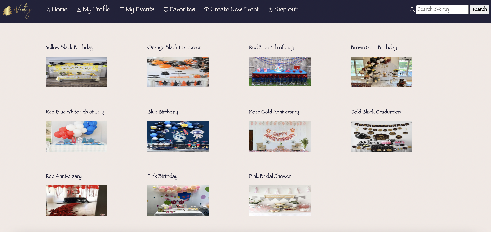

# 
Since there is no one-stop-shop with information and instructions on how to pull off a successful event, eVentry is here to provide you exactly that. eVentry (where creativity shines) is a web application to share and manage an inventory of event ideas, where members can share their events and talk about how, why and where they got various elements. It uses a PostgresQL database to store user added data and is built with a Python/Flask backend.

## About the Developer
Munazzah graduated with a masters degree in CS. Soon after graduation, she moved to the United States on a non-work visa. Munazzah immersed herself in arts & crafts classes and also became involved in event management, as they brought joy and excitement to her life.  She became eligible to legally work in the US but by this time, her software engineering skills were a bit rusty and she was behind on industry trends. Munazzah has always been passionate about problem solving and algorithms. Recently, her path led her back to computer science and reignited her passion for software engineering. She is excited about finally pursuing her dream and passion in IT and software engineering.

## Contents
* [Tech Stack](#tech-stack)
* [Data Model](#data-model)
* [Features](#features)
* [Future State](#future)
* [Installation](#installation)

## <a name="tech-stack"></a>Tech Stack
* Python
* Flask
* WTForms
* HTML
* Jinja
* Bootstrap
* CSS
* PostgresQL
* SQLAlchemy
* JavaScript
* jQuery

## <a name="data-model"></a>Data Model



## <a name="features"></a>Features

#### Homapage
The homepage displays the event categories on the left navbar and top 8 most liked events in the right side. 



#### Sign up/Sign in
Members can sign up or sign in.


#### Profile Page
From the top navbar, the signed in member can view their profile page by clicking on "My Profile"



#### Event Categories
From the side nav bar the member can see the events of a specific category.


#### My Event
From the "My Event" tab in the top nav bar, the member can view their events and can also edit/delete event detais, items, item details and all the images by clicking on the event.


#### Create an Event
From the "Create New Event" tab in the top nav bar, the member can add an event and then the items with all the details and a new event will be added to "My Events" of the member.


#### Favorite $ Likes
From the "Favorites" tab in the top nav bar, the member can view all the events that they have favorited.



Also when a member views any event, they can add it to their favorites by clicking heart icon and also like an event by clicking the thumbs up icon.


#### Search Bar
From the search bar on the right of top nav bar, the member can search for a keyword and the results will be displayed as events & events items matching that keyword.


#### Sign out
When the member clicks the "Sign out" tab in the top nav bar, the member is signed out.


## <a name="future"></a>Future Plans
Future features that are in plans for eVentry include:

* Creating event invites and sending them to guests. 
* Option to the members who are good at DIYs 
  - To host a class for their DIYs.
  - To sell their DIYs.
* Incorporating Ads that are relevant to various events, items and members by implementing Ad slots on the web page.

## <a name="installation"></a>Installation Guide

Here are step by step guidlines to run eVentry on your own machine:

* Install PostgresQL
* Clone this repo:
```
https://github.com/munazzahkhan/hb-project-eVentry
```
* Create and activate a virtual environment inside your eVentry directory:
```
virtualenv env
source env/bin/activate
```
* Install the dependencies:
```
pip install -r requirements.txt
```
* Set up the database:
```
python3 seed.py
```
* Run the app:
```
python3 server.py
```
* Follow the following link to access eVentry:
**http://localhost:5000**

Once the website is up and running you can either create new account, or use these accounts that were added as part of seed.py:
|email|password|
|--|--|
|email1@gmail.com|password|
|email2@gmail.com|password|
|email3@gmail.com|password|
